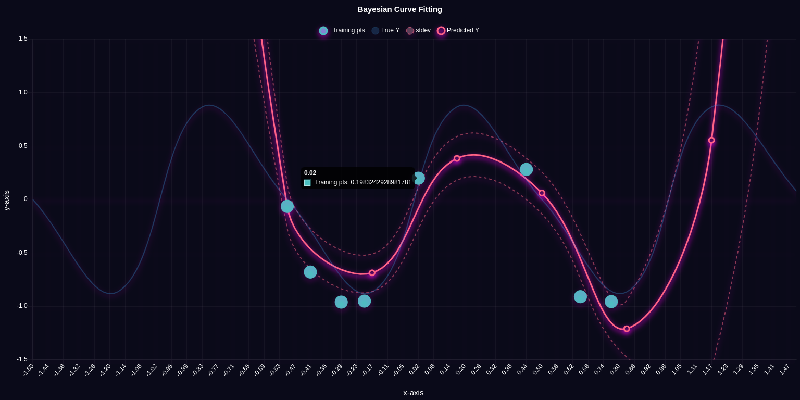
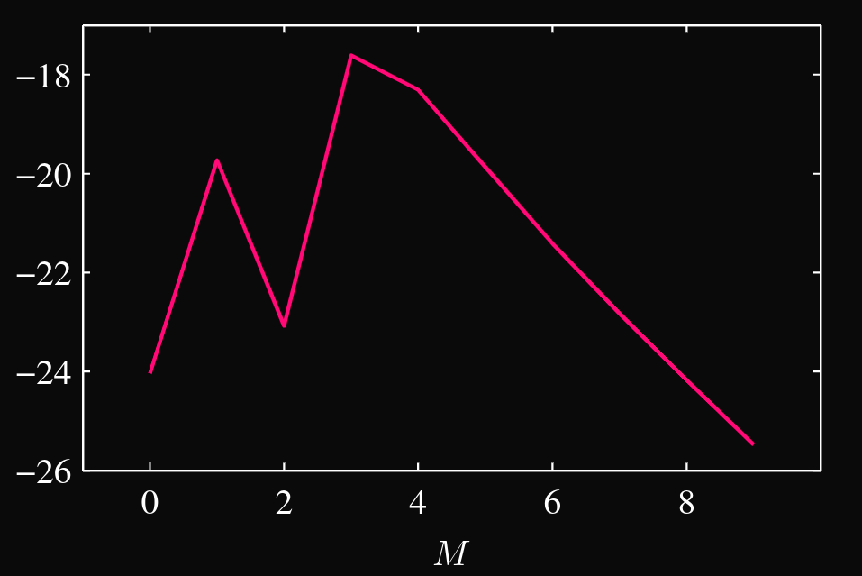

# Bayesian Linear Regression

A simple Library built on top of tensorflow.js which allow you to solve bayesian linear regression problems.

<div style="text-align: center">
    
</div>

## Installation

download or clone this repo and then add this to your index.html

```html

<script src="your_file_path_here/dist/BLR.min.js"></script>
```


## Usage

```javascript

/* generating synthetic data */
const x = tf.linspace(0.1,1.0, 5).expandDims(1); 
const y = tf.sin(y);
const test_x = tf.linspace(-1.5, 1.5, 10).expandDims(1);
const test_y = tf.sin(test_x);

/*specify hyperparameters */
const alpha = 5e-3; // uncertainty in parameter 'w'
const beta  = 11.1; // uncertainty in prediction.

/* creating a model and predicting y */
const blr = BLR(x,y,test_x,test_y);

// fitting a polynomial kernel of degree 8. and fetching our predicted y'es.
const { y:predictedY , yVariance : predVariance } = blr.useBasisFn("polynomial",{degree: 8}).train(alpha,eta).test();


predictedY.print() 
predVariance.print()

```
#### Custom Basis Function

we can also use different basis function as well such as 
gaussian, identity basis functions. or even pass our own custom basis function.

```javascript

// fit 10 gaussian functions onto our data sets. 
blr.useBasisFn("gaussian",{nGaussians: 10});

// identity basis function which is juts f(x) = x;
blr.useBasisFn("identity");

// creating our custom basis function
const myBF = function(x,param = {pow : 2}){
    const pow = param;

    return tf.pow(x,pow)
}

// adding our basis function and using it to fit our data.
blr.addBasisFn(myBF , "myBasisFn").useBasisFn("myBasisFn",{pow: 5});

```

**NOTE**: if alpha and beta are not specified, the function will automatically try to learn the hyperparameters from the training data by using evidence Approximation.

but unfortunatly the huge drawback if this method is that they dont always converges mostly due to the fact that it relay heavily on the initial alpha and betas so if it isn't working for you, then you might try again by setting different init values of alpha and beta :

```javascript

// init hyperparams
const alpha =  0.01;
const beta  =  1e-5;

const {alpha : newAlpha , beta : newBeta } = blr.evidenceMaximization(initAlpha = alpha,initBeta = beta);
```
or you can wait for the next update to come inwhich i implement some other more robust techinques for finding our hyperparameters like ELBO and EM algorithms.

#### Model-selection

we can also do model selection like for eg. if we want to find the most optimial degree for our polynomial function or if we want to find weather should i use gaussian or my own custom basis function.

```javascript

const results = [];
for(let i=0;i<1;i++){
    bcf.useBasisFn("polynomial",{degree: i}).train();
    let k = bcf.evidenceFn(trainX,trainY,alpha,beta).flatten().arraySync();
    results.push(k)
}

```

I can do that by using evidenceFn() method which just calculate the marginal-log-likelihood.

Now if i plot the results it looks something like this:-



which clearly suggest that for this data. degree 3 polynomial is the most optimal option for us and we dont have to calculate the some higher degree polynomial unnecessarily.

#### Generating Data

because we have learned our mean and variance of our parameter PDF we can easily generate pedicted Y by sampling weights from parameter PDFs and that is exactly what this function does:-

```javascript

/* ...some code... */

let blr = BLR(x,y,test_x,test_y);
blr.useBasisFn("polynomial",{degree: 6}).train();

// generate 10 new curves by using the weights sampled from parameter distribution.
blr.genY(SampleSize = 10);

```

and if we plot it, it looks something like this one:-


## Contributing
Pull requests are welcome. For major changes, please open an issue first to discuss what you would like to change.

## License
[MIT](https://choosealicense.com/licenses/mit/)
